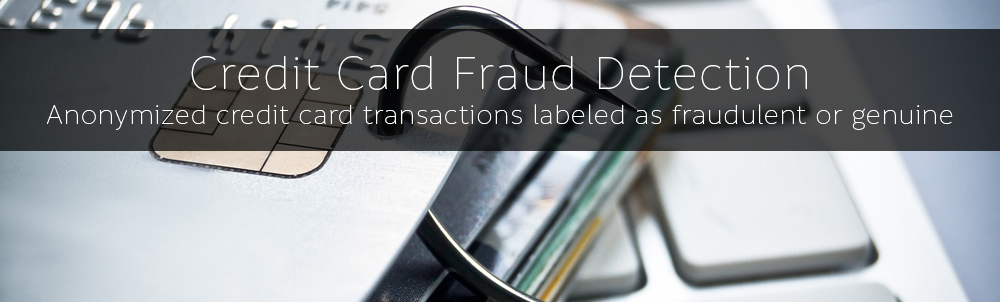

With a further developments of the internet and advancements in social and web hacking everyday clients of banking services worldwide face a risk of having their credit card information stolen and used in unauthorized ways. That's why it is important for banks to not only invests in cybersecurity of their system, but also the fraudulent transaction detection system as the client may of accidentally leaked their credit card information.

The following paper will focus on the fraudulent transactions and attempt to identify them using Unsupervised Machine Learning techniques in association with Supervised Machine Learning ones.

The goal is not to increase the fraudulent detection directly, but to analyze the potential improvements to the Supervised ML models that Unsupervised clusters will give.

Main file to view all the findings and information:
* Credit Card Fraud Detection - Unsupervised.pdf
* Credit Card Fraud Detection - Unsupervised.ipynb